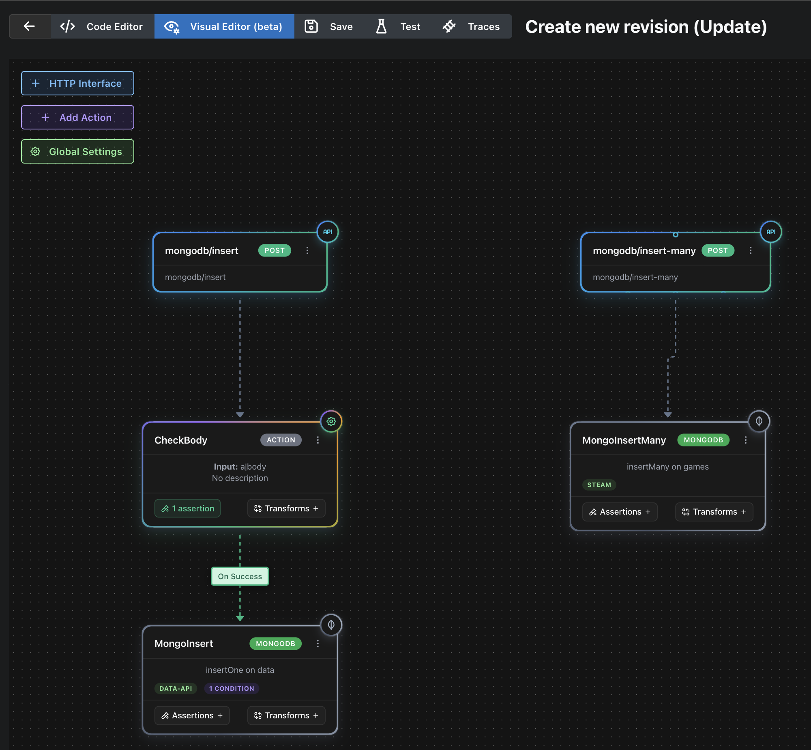

# Air Pipe MongoDB Data API Replacement

## Overview

With MongoDB's deprecation of the Data API, developers need alternative solutions to interact with MongoDB databases through HTTP endpoints. This repository provides a complete replacement using [Air Pipe](https://airpipe.io/), a no-code backend solution that offers the same functionality and more.

Air Pipe provides a flexible, cloud-agnostic platform that can replicate MongoDB Data API functionality across any cloud provider, whether through their SaaS application or self-hosted deployments.

## Why Air Pipe?

- **No-Code Solution**: Configure database operations without writing custom Lambda functions or cloud functions
- **Cloud Agnostic**: Works with any cloud provider or on-premises deployment
- **Complete CRUD Support**: All MongoDB operations supported
- **Aggregation Pipeline Support**: Full MongoDB aggregation capabilities
- **HTTP API Ready**: Instant REST API endpoints
- **Secure**: Built-in authentication and connection management
- **Testing**: Built-in testing for your API's 
- **Visual Editor**: Built-in Visual Editor for you API's
- **Traces**: Built-in config tracing for your API's



## Prerequisities 

Before setting up this MongoDB Data API replacement, you'll need to complete the following:


### MongoDB Atlas Setup: Quick Guide

1.  **Create a Free Cluster**
    * Sign up or log in to [MongoDB Atlas](https://www.mongodb.com/cloud/atlas).
    * Create a new cluster, selecting the free **M0 Sandbox** tier.

2.  **Configure Access**
    * **Database Access**: Add a new database user with a secure password and "Read and write to any database" privileges.
    * **Network Access**: Click "Add IP Address" and select "Allow Access from Anywhere" (`0.0.0.0/0`) for development purposes.

3.  **Get Your Connection String**
    * In your cluster view, click **Connect** -> **Connect your application**.
    * Copy the connection string and replace `<password>` with the password you created in the previous step.

4.  **Load Data (Optional)**
    * **Sample Data**: Click the `...` menu on your cluster and select **Load Sample Dataset**.
    * **Custom Database**: A database and collection (e.g., `data-api.data`) will be created automatically the first time you insert data. You can also create them manually under the **Collections** tab.


### 2. Air Pipe Account Setup

1. **Create Air Pipe Account**
   - Go to [Air Pipe SaaS Platform](https://app.airpipe.io/)
   - Sign up for a new account or sign in to your existing account
   - Complete the account setup process

2. **Set Up Environment Variables**
   
   In your Air Pipe application, configure the following environment variables (using the credentials and connection string from your MongoDB Atlas setup above):
   - `MDB_USER`: Your MongoDB username (from step 3 above)
   - `MDB_PASS`: Your MongoDB password (from step 3 above)
   - `MDB_URL`: Your MongoDB cluster URL without credentials (from step 5 above)


## Setup Instructions

### 1. Deploy Configuration

1. Copy the configuration to your Air Pipe project
2. Ensure your environment variables are configured (from Prerequisites)
3. Deploy to Air Pipe SaaS or your preferred environment

### Complete Test Workflow

Once your Air Pipe configuration is deployed and your MongoDB Atlas database is set up, you can test the complete CRUD workflow:

1. **Create a document** using the create endpoint
2. **Read the document** to verify it was created
3. **Update the document** to change its status
4. **Read again** to verify the update
5. **Delete the document** to clean up
6. **Test aggregation** using the MongoDB sample dataset

## Air Pipe Variable Syntax

Air Pipe uses a specific syntax for dynamic values:

- `a|ap_var::VARIABLE_NAME|` - Secrets
- `a|body::FIELD_NAME|` - Request body fields

| Note ypu can adjust this configuration in a range of ways including using variables, secrets or handling more complex backend logic see [Air Pipe Docs](https://docs.airpipe.io/docs/configuration) for configuration options, examples and tutorials

## Configuration Breakdown

### Global Configuration

```yaml
global:
  databases:
    main: 
      driver: mongodb
      conn_string: |
        mongodb+srv://a|ap_var::MDB_USER|:a|ap_var::MDB_PASS|@a|ap_var::MDB_URL|
```

- **databases.main**: Defines the primary database connection
- **driver**: Specifies MongoDB as the database driver
- **conn_string**: MongoDB connection string using Air Pipe variables for security
  - `a|ap_var::MDB_USER|` - References the MongoDB username from Air Pipe environment variables
  - `a|ap_var::MDB_PASS|` - References the MongoDB password from Air Pipe environment variables
  - `a|ap_var::MDB_URL|` - References the MongoDB cluster URL from Air Pipe environment variables

### Interface Configurations

Each interface creates a HTTP endpoint that performs specific MongoDB operations.

#### 1. Create Operation (POST /mongodb/create)

```yaml
  mongodb/insert:
    method: POST
    output: http

    actions:
      - name: MongoCreate
        database: main
        document_operation:
          database: 'data-api'
          collection: 'data'
          operation: insertOne
          insert: |
                a|body::document|

  mongodb/insert-many:
    method: POST
    output: http

    actions:
      - name: MongoInsertMany
        database: main
        document_operation:
          database: 'steam'
          collection: 'games'
          operation: insertMany
          insert: |
                a|body::docs|
```

- **method**: HTTP POST method for creating data
- **output**: Returns HTTP response
- **database**: References the 'main' database connection
- **document_operation**: Defines the MongoDB operation
  - `operation`: Uses MongoDB's `insertOne` method
  - `filter`: The document to insert (from request body)


#### 2. Read Operation (POST /mongodb/read)

```yaml
  mongodb/read:
    method: POST
    output: http

    actions:
      - name: MongoRead
        database: main
        document_operation:
          database: 'data-api'
          collection: 'data'
          operation: findOne
          filter: '{"name": "a|body::name|"}'

```

- **operation**: Uses MongoDB's `findOne` method
- **filter**: Query filter using the 'name' field from request body
- Finds a single document matching the specified name

#### 3. Update Operation (POST /mongodb/update)

```yaml
  mongodb/update:
    method: POST
    output: http

    actions:
      - name: MongoUpdate
        database: main
        document_operation:
          database: 'data-api'
          collection: 'data'
          operation: updateOne
          filter: '{"name": "a|body::name|"}'
          update: '{"$set": {"active": a|body::status|}}'
```

- **operation**: Uses MongoDB's `updateOne` method
- **filter**: Finds document by name field
- **update**: Uses MongoDB's `$set` operator to update the 'active' field with status from request body

#### 4. Delete Operation (POST /mongodb/delete)

```yaml
  mongodb/delete:
    method: POST
    output: http

    actions:
      - name: MongoDelete
        database: main
        document_operation:
          database: 'data-api'
          collection: 'data'
          operation: deleteOne
          delete: '{"name": "a|body::name|"}'
```

- **operation**: Uses MongoDB's `deleteOne` method
- **filter**: Identifies document to delete by name field

#### 5. Aggregate Operation (POST /mongodb/aggregate)

```yaml
  mongodb/aggregate:
    method: POST
    output: http

    actions:
      - name: MongoAggregate
        database: main
        document_operation:
          database: 'sample-analytics'
          collection: 'customers'
          operation: aggregate
          pipeline: |
            [ {
                "$match": {
                  "username": { "$regex": "^a|CheckBody::starts_with|", "$options": "i" }
                }
              },
              {
                "$project": {
                  "_id": 1,
                  "username": 1,
                  "email": 1
                }
              },
              {
               "$limit": 30
              }
            ]

```

- **operation**: Uses MongoDB's `aggregate` method
- **pipeline**: Multi-stage aggregation pipeline:
  1. **$match**: Filters documents where username starts with specified text (case-insensitive regex)
  2. **$project**: Selects only _id, username, and email fields
  3. **$limit**: Limits results to 30 documents


### Complete Test Workflow

Once your Air Pipe configuration is deployed and your MongoDB Atlas database is set up, you can test the complete CRUD workflow:

1. **Create a document** using the create endpoint
2. **Read the document** to verify it was created
3. **Update the document** to change its status
4. **Read again** to verify the update
5. **Delete the document** to clean up
6. **Test aggregation** using the MongoDB sample dataset

#### Testing Sequence Example

Use Air Pipe's API Tester or curl the API URL


## Additional Resources

- [Air Pipe Documentation](https://docs.airpipe.io/)
- [Air Pipe SaaS Platform](https://airpipe.io/)
- [MongoDB Connection String Format](https://docs.mongodb.com/manual/reference/connection-string/)

## Support

For Air Pipe-specific questions, refer to their documentation or support channels. For MongoDB-related questions, consult the official MongoDB documentation or public forums.

## License

This configuration is provided as-is for educational and development purposes. Ensure you comply with Air Pipe's terms of service and MongoDB's licensing requirements.
